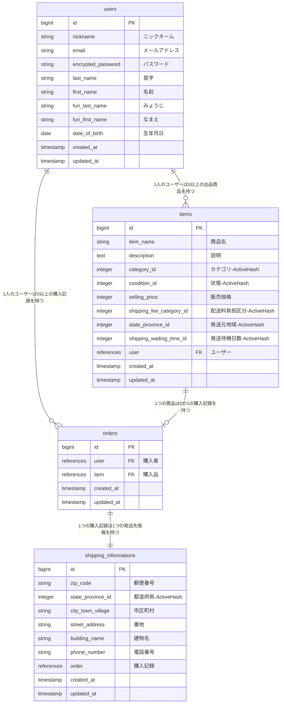

# README

# ER図

# テーブル設計

## users（ユーザー情報） テーブル

| Column             | Type    | Options     |
| ------------------ | ------- | ----------- |
| nickname           | string  | null: false |
| email              | string  | null: false, unique: true |
| encrypted_password | string  | null: false |
| last_name          | string  | null: false |
| first_name         | string  | null: false |
| furi_last_name     | string  | null: false |
| furi_first_name    | string  | null: false |
| date_of_birth      | date    | null: false |

### Association

- has_many :items
- has_many :orders

## items（出品商品情報） テーブル

| Column                   | Type       | Options     |
| ------------------------ | ---------- | ----------- |
| item_name                | string     | null: false |
| description              | text       | null: false |
| category_id              | integer    | null: false |
| condition_id             | integer    | null: false |
| selling_price            | integer    | null: false |
| shipping_fee_category_id | integer    | null: false |
| state_province_id        | integer    | null: false |
| shipping_waiting_time_id | integer    | null: false |
| user                     | references | null: false, foreign_key: true |

### Association

- belongs_to :user
- has_one :order

## orders（購入記録） テーブル

| Column | Type       | Options                        |
| ------ | ---------- | ------------------------------ |
| user   | references | null: false, foreign_key: true |
| item   | references | null: false, foreign_key: true |

### Association

- belongs_to :user
- belongs_to :item
- has_one :shipping_information

## shipping_informations（発送先情報） テーブル

| Column            | Type       | Options     |
| ----------------- | ---------- | ----------- |
| zip_code          | string     | null: false |
| state_province_id | integer    | null: false |
| city_town_village | string     | null: false |
| street_address    | string     | null: false |
| building_name     | string     |             |
| phone_number      | string     | null: false |
| order             | references | null: false, foreign_key: true |

### Association

- belongs_to :order
