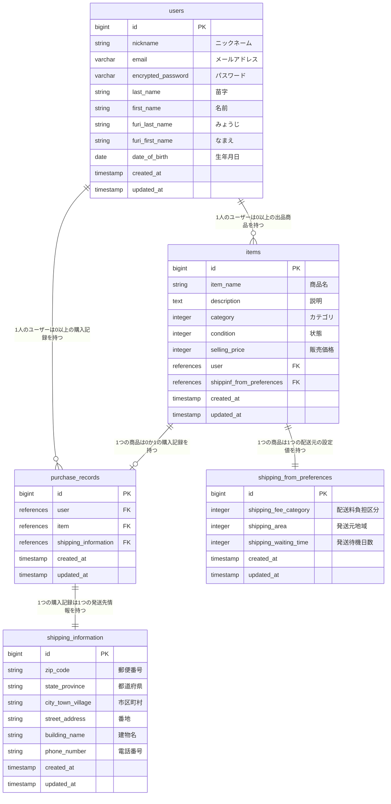

# README

# ER図

# テーブル設計

## users（ユーザー情報） テーブル

| Column             | Type    | Options     |
| ------------------ | ------- | ----------- |
| nickname           | string  | null: false |
| email              | varchar | null: false, unique: true |
| encrypted_password | varchar | null: false |
| last_name          | string  | null: false |
| first_name         | string  | null: false |
| furi_last_name     | string  | null: false |
| furi_first_name    | string  | null: false |
| date_of_birth      | date    | null: false |

### Association

- has_many :items
- has_many :purchase_records

## items（出品商品情報） テーブル

| Column                    | Type        | Options     |
| ------------------------- | ----------- | ----------- |
| item_name                 | string      | null: false |
| description               | description | null: false |
| category                  | integer     | null: false |
| condition                 | integer     | null: false |
| selling_price             | integer     | null: false |
| user                      | references  | null: false, foreign_key: true |
| shippinf_from_preferences | references  | null: false, foreign_key: true |

### Association

- belongs_to :user
- has_one :purchase_record
- has_one :shipping_from_preference

## shipping_from_preferences（発送元情報） テーブル

| Column                | Type    | Options     |
| --------------------- | ------- | ----------- |
| shipping_fee_category | integer | null: false |
| shipping_area         | integer | null: false |
| shipping_waiting_time | integer | null: false |

### Association

- belongs_to :item

## purchase_records（購入記録） テーブル

| Column               | Type       | Options                        |
| -------------------- | ---------- | ------------------------------ |
| user                 | references | null: false, foreign_key: true |
| room                 | references | null: false, foreign_key: true |
| shipping_information | references | null: false, foreign_key: true |

### Association

- belongs_to :user
- belongs_to :item
- has_one :shipping_information

## shipping_information（発送先情報） テーブル

| Column            | Type   | Options     |
| ----------------- | ------ | ----------- |
| zip_code          | string | null: false |
| state_province    | string | null: false |
| city_town_village | string | null: false |
| street_address    | string | null: false |
| building_name     | string |             |
| phone_number      | string | null: false |

### Association

- belongs_to :shipping_information
